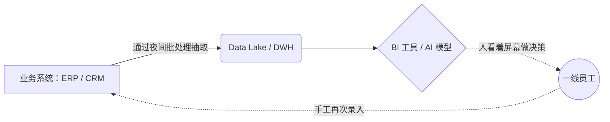
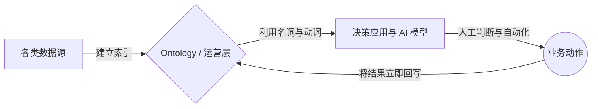
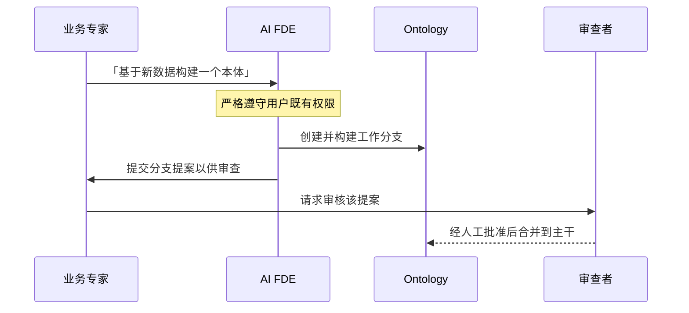
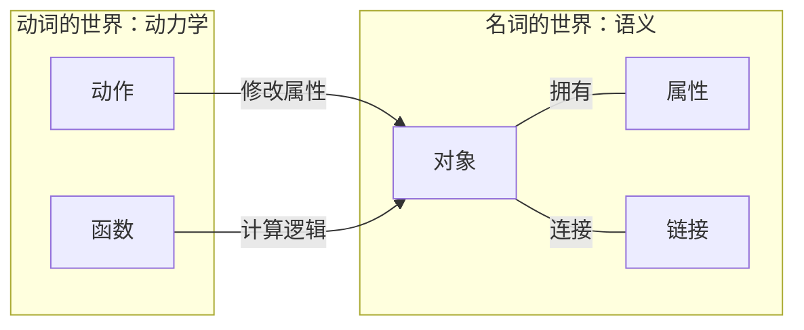
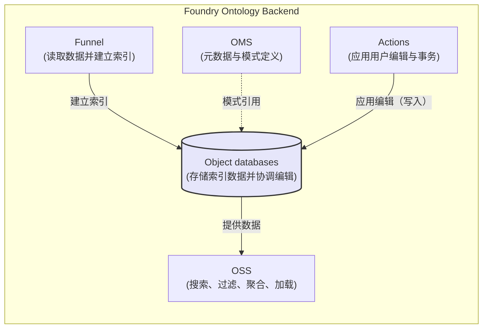
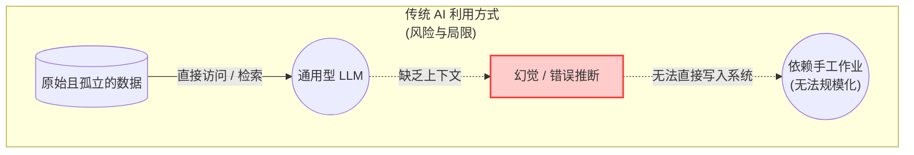
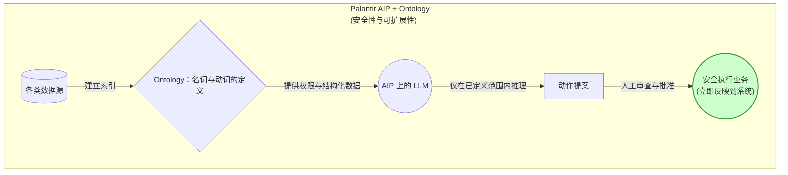
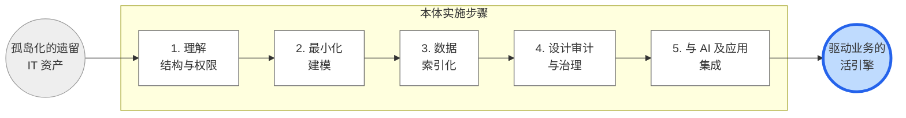

# Palantir 的冲击：连接数据与 AI 的本体战略

  

*其他语言版本：[English](the-palantir-impact_en.md) | [日本語](the-palantir-impact_jp.md)*

## 第一部分：问题与范式

### 序章：为何「数据整合」会在 AI 时代失败

不妨想一想贵公司的数据基础设施（Data Lake 或 Data Warehouse）。 
企业已经投入巨额预算，把公司里每一个系统中的数据都抽取汇入这套基础设施。 
其上再叠加 BI（商业智能）工具，每天为管理层更新精美的仪表盘。 

然而，把视线转向业务一线，却会看到令人难以置信的景象。 
「这个仪表盘上的销售预测不对。原始数据在哪里？」一位经理一边追问，一边把 Excel 文件传来传去。 
「我们用 AI 做了需求预测模型，但它连不上日常订货系统，所以我最后还是得一边看着屏幕一边手动录入。」一位运营人员叹着气说。 
即便已经建设了数据基础设施，业务流程依旧彼此割裂。 

为什么这种悲剧会在全球企业中反复上演？ 
根本原因在于：长期以来，我们只把数据当作 **「用于分析的静态快照（只供查看的数据）」**。 

如上图所示，在传统系统架构中，「存放并展示数据的地方（DWH/BI）」与「执行业务并写入变更的地方（业务系统）」是完全断开的。

只要这种结构性断裂还存在，无论引入多么先进的 AI 模型，最终的行动仍然依赖人的「手工作业（重复录入）」，无法规模化。

#### Palantir 带来的范式转变：把本体作为运营层

本书所阐释的 Palantir **「Ontology（本体）」** 战略，正是一场从根本上打破数据孤岛这一沉疴顽疾的范式转变。

在知识工程与语义网的语境中，被广泛引用的学术定义来自 Gruber（1993）：本体是「对概念化的明确规范」（explicit specification of a conceptualization）。

随后，Studer 等人（1998）进一步扩展，提出了「对共享概念化的形式化的、明确的规范」（formal, explicit specification of a shared conceptualization）这一定义。

这种从「只供查看的数据」到「直接驱动业务的数据」的转变，正是 AI 时代真正数字化转型的关键。

---

### 第 1 章：神秘独角兽「Palantir」的真实身份，以及真正的数据整合

在触及本体这项技术的深处之前（自第 2 章起），我们必须先弄清楚「Palantir」究竟是谁。

它与 AWS、Snowflake 这类通用云厂商，以及 Salesforce 这类 SaaS 公司，有着完全不同的基因。

#### 1-1. 源自 CIA 与战场的基因

Palantir Technologies 成立于 2003 年，由 Peter Thiel（PayPal 联合创始人）与现任 CEO Alexander Karp 共同创立。

早期的重要投资方包括 In-Q-Tel——CIA（美国中央情报局）旗下的风险投资机构。

他们开发的第一个平台「Palantir Gotham」，是为美国国防部与情报机构的绝密任务而构建的，例如追踪恐怖分子网络、开展网络安全行动。

在战场与情报前线，「数据孤岛」和「系统缺乏集成」不仅仅意味着效率低下，而是 **直接导致「人员伤亡」与「国家危机」的致命缺陷。**

把各种格式、彼此分散的数据连接起来，瞬时掌握全局，并立即转入下一个运营动作（action）——Palantir 对「运营」与「治理」的极致执念，正是在这些极端环境中锻造出来的。

#### 1-2. 不是「数据盒子」，而是「组织操作系统」

Palantir 在整个通用 IT 生态中确立了独特的定位。

- **与基础设施 / DWH 厂商（AWS、Google Cloud、Snowflake 等）的区别：** 它们提供的是以低成本存储和计算海量数据的「盒子（底座）」。

但至于如何用盒子里的数据驱动业务，则留给客户自己解决。

Palantir 并不取代这些盒子，而是位于它们之上，充当一个「把数据转化为决策与行动的层」。

- **与业务型 SaaS（Salesforce、SAP 等）的区别：** SaaS 能极大地简化「销售」或「人力资源」等特定部门的业务。

但企业使用的、面向部门优化的 SaaS 越多，公司整体的数据就越容易形成孤岛。

Palantir 整合这些分散的 SaaS 与遗留系统中的数据，提供一个俯瞰整个组织的「单一操作系统」。

#### 1-3. 从战场走向企业：Foundry 与 AIP 的诞生

本书的主角 **「Palantir Foundry」**，正是为了把在国防与情报机构锤炼出的压倒性数据整合与分析专长，应用于私营企业的复杂运营（制造、金融、医疗、供应链等）而诞生的。

Architecture Center 的文档指出：本体是 Palantir 架构的核心，其设计目的不只是整理数据，而是表达「企业复杂且相互关联的决策」。

如今，Palantir 又在 Foundry 这一坚实的本体底座之上，部署了可安全集成最新大语言模型（LLM）的 **「AIP（AI Platform）」**。

AIP 运行在客户的私有网络内，提供了一个让 AI 能够安全执行现实业务任务的环境。

#### 1-4. 正面应对企业复杂性：独特的「FDE」组织模式

大型企业中的数据整合，是一项与部门间冲突和无数遗留系统深度纠缠的极高难度工程。

Palantir 之所以受到支持，最大的原因与其说在于其优秀的软件，不如说在于它的实施方式。

根据外部分析（Everest Group），Palantir 会把自家工程师直接嵌入客户的运营环境，在 Palantir 技术栈上构建生产级工作流。

FDSE（Forward Deployed Software Engineers，前线部署软件工程师）聚焦于单一客户，协同构建可直接投产的、生产级质量的工作流。

在一线快速构建系统的同时，Foundry 平台本身又内建了维持治理的设计哲学。

具体而言，Ontology Proposals（本体提案）的机制是：所有变更都在从主版本派生的分支上进行，只有经过审查/批准后才合并回主干（类似 Pull Request）。

此外，Foundry Branching 规定：分支必须绑定于「单一本体」，从提案创建到审查、合并的生命周期被严格执行。

#### 1-5. 当 AI 成为工程师：AI FDE 的冲击

令人惊讶的是，「Forward Deployed（前线部署）」这一概念正在从人延伸到 AI。

Palantir 提供了一个名为 **AI FDE（AI-powered forward deployed engineer，AI 前线部署工程师）** 的交互式代理，它能把自然语言需求翻译为 Foundry 操作，接管创建数据转换流水线、代码仓库管理以及本体构建与维护等任务。

不过，Palantir Foundry 中的本体虽然建立在「本体即知识表示」这一通用概念之上，其设计却是一个驱动组织运营的 **「运营层 / 数字孪生」**。

Foundry 官方后端文档将 Foundry Ontology 定位为「组织的运营层」：它把数据集等数字资产与现实世界中的资产和概念绑定起来，使其「发挥数字孪生的作用」。

听到 AI 能自动构建系统，人们或许会担心它失控；但这套流程在设计上「遵守用户既有权限」，并且「始终提交分支提案供人审查」。

这显著降低了误用或敏感数据过度暴露的风险，使人类与 AI 能够安全协作。

---

### 第 2 章：作为 Palantir 心脏的「本体」到底是什么？

要真正理解 Palantir Foundry 并以此重塑你的业务，就必须深入理解「Ontology」概念所带来的范式转变。

本章将深入剖析这种用「名词与动词」为世界建模的独特架构。

#### 2-1. 用「名词」和「动词」为数据世界建模

Palantir 的本体之所以优于其他方案，最大的原因在于：它把系统定义为 **Semantics（语义：对象、属性、链接）** 与 **Kinetics（动力学：动作、函数、动态安全）** 的统一体。

通常，数据库设计止于「名词（数据）」的设计，而「动词（业务逻辑与更新流程）」则被拆分到另一个应用层中。

但在 Foundry 中，所需的要素被明确划分为语义要素与动力学要素，并放在一起共同定义。

**1. 语义要素（名词的世界：意义）**

- **Object type：** 表示现实世界概念（名词）的类型，以数据源为输入生成对象实例。
- **Property：** 对象的属性。
- **Link type：** 对象类型之间的关系，支持一对一、一对多和多对多关系。
  

**2. 动力学要素（动词的世界：运动）**

- **Action / Action type：** Action 是修改一个或多个对象属性的单一事务。Action type 包含可执行的变更集以及副作用定义。
- **Functions：** 可快速执行的逻辑，用于支撑运营仪表盘与决策应用。
- **Dynamic security：** 被明确列为本体的动力学要素，用于动态控制各项操作。

通过同时创建「用于查看的模型」与「用于变更的模型」——让数据模型闭环、把更新路径也包含进来——AI 与应用程序便能放心地对现实世界执行安全的动作。

## 第二部分：行动的架构

### 第 3 章：[可视化] 支撑本体的架构

本体并不只是一个概念上的想法，它在物理上由极为稳健的微服务所支撑。

要在系统上为现实世界建模，就必须有一套能够处理「语义（定义）」与「动力学（执行）」的强大后端。

#### 3-1. 架构的五大支柱

在 Foundry 官方后端文档中，这套架构以 Object Storage V2 为中心，由以下服务分担不同职责：

- **OMS（Ontology Metadata Service，本体元数据服务）：** 负责定义 object type、link type 和 action type 的综合性服务。本体的「模式（schema）」正是在这里决定的。
- **Object databases：** 系统的心脏，负责存储索引数据、执行查询，并协调各项编辑。
- **OSS（Object Set Service，对象集服务）：** 提供本体读取能力，支持搜索、过滤、聚合与加载。
- **Actions：** 处理把现实世界的变化反映进系统的编辑（写操作）。它支持复杂的权限控制，并生成历史 action 日志。
- **Funnel（Object Data Funnel，对象数据漏斗）：** 读取数据源与用户编辑，并将其建立索引后写入 object databases。

#### 3-2. 为现实世界建立索引，以及物理约束

「建立索引（Indexing）」是把数据转换为可供本体使用的索引。这一过程由 Funnel 负责监督，并根据使用场景采用批处理（Funnel batch）或流处理（Funnel streaming）管道。

索引的目标是 Object Storage V2；Funnel 协调这些管道来创建和修改对象实例，使数据与元数据保持最新。

- **Funnel batch pipeline：** 一条内部作业流水线，高效地将数据源或用户编辑建立索引。
- **Funnel streaming pipeline：** 以 Foundry Streams 为输入，实现秒级到分钟级的低延迟索引。

不过，架构师还必须理解其中的物理约束。

目前，Streaming object types（流式对象类型）存在一些官方列出的限制，例如不支持用户编辑，也不支持 MDO（Multi-Dataset Objects，多数据集对象）。

---

### 第 4 章：支撑企业的「治理与安全」

当数据成为「运营层」之后，系统中的变更会立即驱动现实业务。

对于分析型仪表盘来说，数据错了，最坏的结果也不过是「图表看起来有点怪」。但在一个通过本体自动执行订货与状态变更的环境中，

一次故障就会直接导致致命的现实损害（事故），例如「误下单 1 万个不必要的零件」或「让工厂的生产线停摆」。

正因为拥有以压倒性速度改写现实的能力，Palantir 在平台的根基处嵌入了远超一般 IT 工具的、强韧的治理与故障安全（fail-safe）机制。

#### 4-1. 安全范式的转变：从「隐藏」到「安全地行动」

在传统企业 IT 中，安全主要意味着「隐藏数据」（访问限制与加密）。

但在本体驱动的架构中，安全的定义被提升为「防止对现实世界造成错误的变更与破坏」。

谁能够基于哪些数据，执行什么样的业务逻辑（action）？

对这些「动力学要素」的严格控制，正是 Foundry 从军方与情报机构继承而来的那套强韧治理的本质所在。

#### 4-2. 数据世界中「分支」与审查的生命周期

Palantir 把软件工程中久经历史验证的「版本控制」与「同行评审」最佳实践，直接带入了数据建模与现实运营流程。

其核心就是 **Branching（分支）** 与 **Proposal（提案）** 机制。

- **Ontology Proposals（提案与审批流程）：** 当变更现实运营规则（本体模式定义或 action 行为）时，即便是工程师也不能直接改写生产环境。

变更要在从主版本派生的「工作分支」上安全地进行、经过测试，只有在审查与批准之后，才合并进主环境。

这相当于把开发中常用的 Pull Request 概念应用到了数据运营上。

- **Foundry Branching 的严格执行：** 分支被集中管理，且必须绑定于「单一本体」。

由于从提案创建到审查、合并的生命周期由平台层面强制执行，影子 IT 或特定人员未经授权的运营变更，在结构上就被杜绝。

#### 4-3. 支撑复杂组织的「Approvals App」

在大型企业中，「谁拥有审批权」本身就是一件复杂的事。

为了支持部门负责人、合规官、数据所有者等多元利益相关者之间达成共识，Foundry 提供了专门的「Approvals」应用。

该应用集中管理审批工作流，并无缝地整合同行评审与合规检查。

这让流程本身变得完全透明：「这项变更在何时、由谁、基于什么理由获得批准」。

#### 4-4. 精细的访问控制，以及终极审计轨迹「Action Log」

对「显示/隐藏」的控制，以及对「谁做了什么」的记录，其实现粒度是传统 DWH 无法比拟的。

- **通过 Restricted Views（RVs，受限视图）与 MDOs 进行控制：** 访问控制不仅限于通过 Restricted Views（RVs）实现的「行级」控制。

官方还支持通过 Multi-Dataset Object types（MDO，多数据集对象类型）实现「列/属性级」控制。

这使得精细治理成为可能，例如「客户的购买历史可以全公司共享，但可识别个人身份的姓名和电话号码只能由特定部门查看」。

此外，授权模型也正在从依赖数据源的权限，转向基于本体角色（ontology roles）的模型。

- **终极审计轨迹：「Action Log」** 治理的最后一道堡垒，是 Action Log。

在 Foundry 中，每一次 action 提交都会被建模为「一个对象类型本身」，并被永久记录。

与 Action type 一一对应的日志对象，会为每次提交自动生成，详细记录谁在何时改写了哪些数据，并链接到被编辑的目标对象。

这保证了完整的、近乎永久的可追溯性。

---

## 第三部分：智能的命运

### 第 5 章：正在改变世界与日本的 Palantir 用例

被称为「运营层」的本体，究竟如何改变业务的运行机制？

这个诞生于极端国防环境的平台，如今正在为全球企业以及日本的基础设施企业解决高度现实的业务挑战。

下面，我们基于已公开的一手资料，以更高的分辨率审视它压倒性的实绩。

#### 5-1. 航空与制造：Airbus（500 万零件的数字孪生与 Skywise）

Palantir 与欧洲航空巨头 Airbus 的合作，是制造业中本体应用的一座里程碑。

他们面对的，正是「孤岛的极限」本身。

- **A350 生产的戏剧性提速：** 最先进的 A350 由约 500 万个零件构成，在多个欧洲国家、工厂以及无数供应商与团队之间分散制造。

过去，零件延误与质量问题的数据彼此分散，在飞机完工之前，没有人能掌握「全貌」。

通过把这些分散的数据整合进 Foundry 的本体，并把所有零件与进度计划之间的关系链接起来，

识别瓶颈、确定任务优先级成为可能，最终成功将 A350 的交付提速了 33%。

- **进化为行业标准平台「Skywise」：** Airbus 并未止步于自身制造体系的变革，而是与 Palantir 共同构建了一个覆盖整个航空业的平台「Skywise」。

目前，已有超过 100 家航空公司使用这一底座，在本体之上处理 PB 级的时序数据——来自每架飞机上多达 20,000 个传感器、每秒「20 到 100 个数据点」。

这使得零件故障预测与预防性维护成为可能，大幅降低了航班取消的风险。

#### 5-2. 保险与医疗健康：SOMPO（构建真实数据平台）

在日本，本体也正深入渗透到「优化社会基础设施」这一使命之中。

SOMPO Holdings 将 Palantir 作为其「Real Data Platform（RDP，真实数据平台）」构想的核心。

- **护理业务的数字化转型：** 在 SOMPO Care 运营的护理机构中，使用者的健康状态、员工排班与护理记录被整合进 Foundry。

数据不只是被收集起来，而是作为决策支持，帮助一线员工判断下一步的最优行动（护理支持或紧急响应）。

- **改造 Sompo Japan 的业务流程：** 在保险理赔流程中，构建了基于本体的欺诈检测与理赔分流（优先级判定）系统。

日本已有超过 8,000 人在日常工作中积极使用这一平台，成功把一线的「手工作业」替换为本体上的「动作」。

#### 5-3. 日本企业生态：Fujitsu × Palantir

此外，为了突破日本特有的遗留系统环境，双方还结成了强有力的合作关系。

在一篇新闻稿（2023 年 12 月）中，Fujitsu 强调 Fujitsu 与 Palantir Japan 已扩大其全球合作伙伴关系。

许多日本大型企业出于对云安全的顾虑，仍把数据封闭在本地部署或私有网络中。

这正是「AIP（AI Platform）」与「Foundry」的组合发挥作用的地方——在客户的封闭网络内安全地利用 LLM。

随着这个连接数据、分析与运营的底座成形，即使在安全要求严苛的日本金融机构、政府机关与制造业中，真正数据驱动业务的社会化落地也在迅速推进。

---

### 第 6 章：本体 × AI 将带来的未来

当前，全球企业都在争相「在内部落地生成式 AI（LLM）」。

但其中大多数都止步于「内部聊天机器人」「会议纪要」这类表层的效率提升。

原因很清楚：AI 缺少驱动真实业务的「共同语言（本体）」和「手和脚（actions）」。

#### 6-1. 用「语义」之墙与 LLM 的边界遏制幻觉

大语言模型（LLM）拥有卓越的推理与自然语言处理能力，但它无法直接操作现实系统，比如「A 公司库存不足，所以从 B 仓库发出 100 件货」。

此外，它也无法完整理解企业内部规章与复杂的业务语境，始终带着产生幻觉（看似合理的谎言）的风险。

在这里，本体充当了 AI 的「坚实地基」。

在 Foundry 的 AIP（AI Platform）环境中，AI 读取的不是「原始而杂乱的数据」，而是被严格定义、结构化为「名词（objects）」与「动词（actions）」的本体。

由于 AI 只能在「已定义动作」的范围内推理与提案，语境污染与幻觉被最大限度地遏制，从而能够安全地执行现实动作。

#### 6-2. 借助 AI FDE 消除运营构建成本

更进一步，Palantir 已把 AI 从单纯的「用户辅助工具」提升为 **「自己构建系统的工程师（AI FDE）」**。

过去，构建数据整合底座需要数据工程师投入大量时间连接数据源、做映射、搭建流水线。

但随着 AI-powered forward deployed engineer（交互式代理）的出现，局面完全改变。

只需用自然语言提出「基于新的 CRM 数据构建一个客户本体」，AI 就会把它翻译为 Foundry 操作指令，自动作为代理去创建数据流水线、维护本体。

#### 6-3. 支撑「人类与 AI 共进化」的平台

让 AI 构建系统，危险吗？不，Palantir 的架构防止了这种情况的发生。

AI FDE 严格遵守用户既有的权限，并让用户自行选择向模型暴露哪些工具与数据。

做出变更时，它始终会创建一个「Branch Proposal（分支提案）」，提交给人类审查。

人类从繁琐的「连接数据」工作中解放出来，转向更高阶的角色：审查并批准 AI 构建的本体与提出的动作，确保它们「符合业务意图」。

正是因为有了本体这门共同语言，人类与 AI 才第一次能够安全、对等地协作，以可扩展的方式让业务持续进化。

---

### 终章：用本体思维设计你所在组织的数据

我们正站在一个决定性的转折点上：从「看数据的时代」转向「数据直接驱动决策的时代」。

无论 AI 变得多么聪明，只要一家公司的数据仍然是「孤岛系统的残骸」，它的智能就无法抵达业务一线。

构建本体，不仅仅是引入一套 IT 系统。

它等同于用「名词」与「动词」重新定义你自己的业务，并为人类、AI 与系统创造一门「整个组织的共同语言」。

#### 分步实施课程（行动计划）

构建本体驱动的架构看似宏大，却可以一步一步稳步推进。

基于官方文档，我们推荐以下分步路径，作为学习与实施的路线图。

1. **理解基础设施与权限模型（第 1 个月）** 首先理解 OMS / OSS / Funnel / Actions / Object databases 等后端组件的职责。同时学习 Palantir 独有的权限模型，如 RVs（Restricted Views）与本体角色（ontology roles），夯实治理的基础。
2. **最小化建模与分支操作（第 2 个月）** 在一个具体的、较小的领域（例如单一产品线的库存管理）中实际设计 Objects / Links / Actions。这一阶段的关键，是亲自走一遍完整流程：为 action 定义提交条件与副作用、创建 Proposal、再进行审查/批准。
3. **验证数据流水线（第 3 个月）** 搭建一条数据流：数据源经 Funnel 被索引到 OSv2，使其可搜索、可聚合。在理解批处理与流处理的差异及其各自物理限制之后，验证数据的新鲜度与稳定性，确保它足以承受真实运营。
4. **设计审计与治理规则（第 4 个月）** 设计围绕 Action 驱动更新、action log 生成以及物化（materialization，即持久化）的运营规则。启用 Action Log 功能，检查「由谁做出的编辑」如何反映到生产数据中并被追踪，使之与贵公司的合规要求对齐。
5. **与 AI 及外部应用集成（第 5 个月及以后）** 让完成的本体能够被外部系统、AIP 与自定义应用安全地读取和写入。在 Developer Console 中生成 OSDK（Ontology SDK），在适当的 token 管控下，让真实的业务应用来驱动本体。
  

只有当数据与使用者的意图相连，并被转化为现实世界中的行动时，它才会为社会带来「Impact」。

摆脱那些只能让你盯着分析结果的遗留 IT 资产吧。以本体为新的罗盘，把你所在组织的数据从「死去的记录」变成「驱动业务的活引擎」。

---

## 参考资料 - 中文版

以下资料用于界定技术概念、核验架构规格，并记录真实世界中的影响。

### 1. 学术论文
- **Gruber, T. R. (1993). "A translation approach to portable ontology specifications."**
  - URL: [Partisanship and the vote in Australia: Changes over time 1967–1990 | Political Behavior | Springer Nature Link](https://link.springer.com/article/10.1007/BF00993851)
- **Studer, R., Benjamins, V. R., & Fensel, D. (1998). "Knowledge engineering: Principles and methods."**
  - URL: [https://doi.org/10.1016/S0169-023X(97)00039-6](https://www.google.com/search?q=https://doi.org/10.1016/S0169-023X(97)00039-6)

### 2. Palantir 官方资料
- **Palantir Foundry: Ontology Documentation**
  - URL: [Overview • Ontology • Palantir](https://www.palantir.com/docs/foundry/ontology/overview/)
- **Palantir AIP: Security and Operations**
  - URL: [Palantir Artificial Intelligence Platform](https://www.palantir.com/platforms/aip/)
- **Foundry Architecture & Microservices Guide**
  - URL: [https://www.palantir.com/docs/foundry/architecture/overview/](https://www.google.com/search?q=https://www.palantir.com/docs/foundry/architecture/overview/)

### 3. 案例研究与影响报告
- **Airbus: Skywise and A350 Production Acceleration**
  - URL: [Impact | Airbus and Skywise](https://www.palantir.com/impact/airbus/)
- **SOMPO Holdings: Digital Transformation in Nursing Care and Insurance**
  - URL: [https://www.palantir.com/impact/sompo-holdings/](https://www.google.com/search?q=https://www.palantir.com/impact/sompo-holdings/)
- **Fujitsu & Palantir Partnership Expansion (Global Press Release)**  
  - URL: [https://www.fujitsu.com/global/about/resources/news/press-releases/2023/1212-01.html](https://www.google.com/search?q=https://www.fujitsu.com/global/about/resources/news/press-releases/2023/1212-01.html)

---
